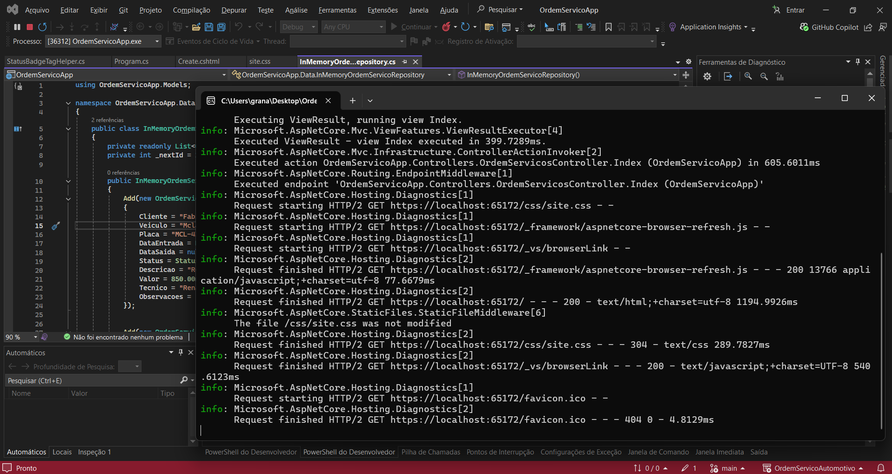
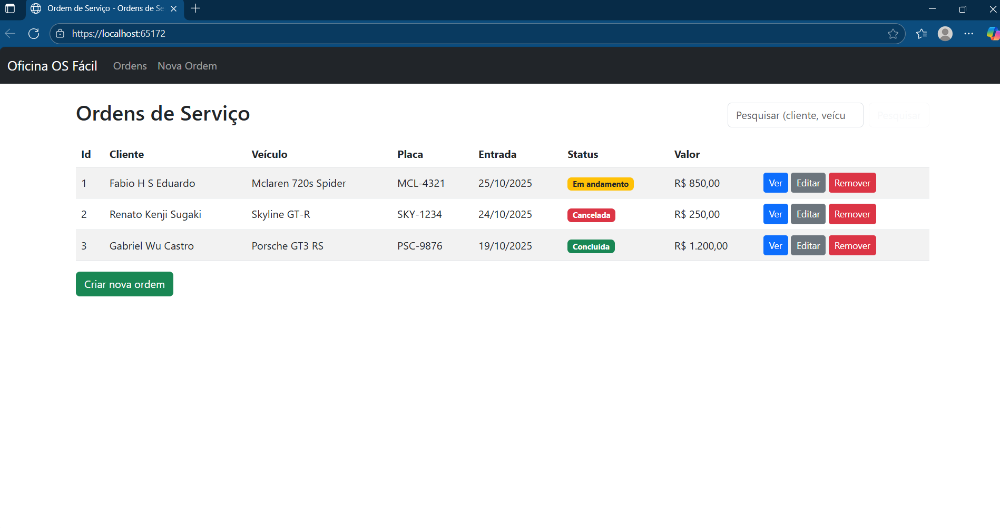
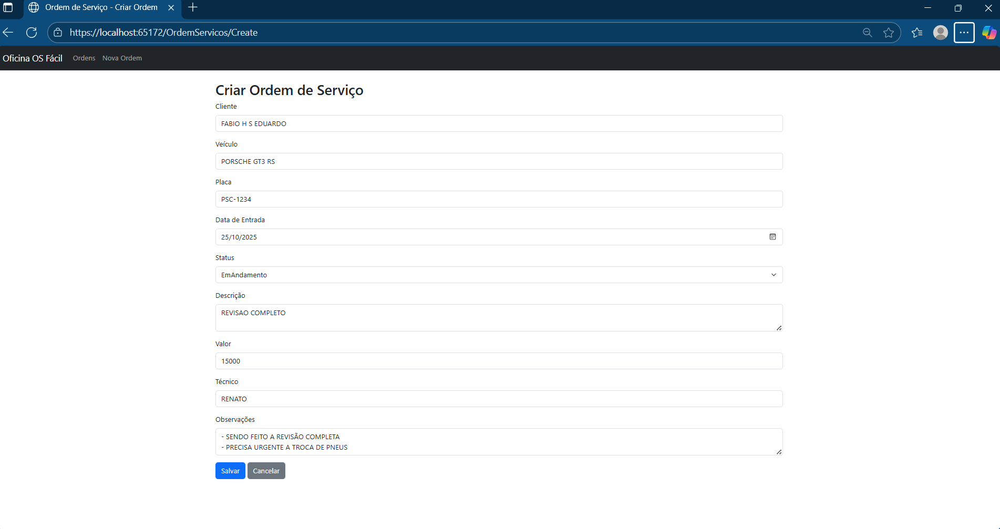
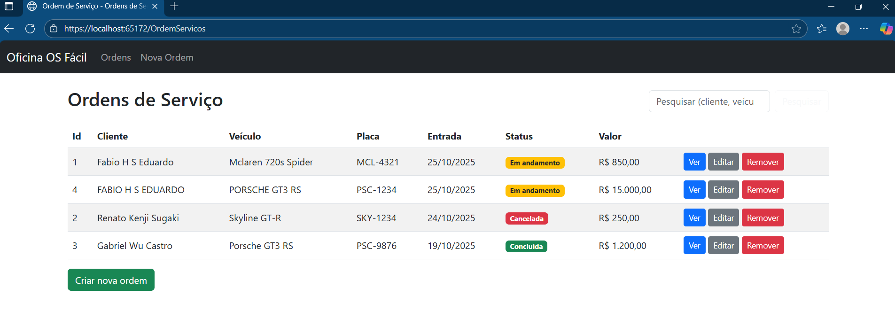
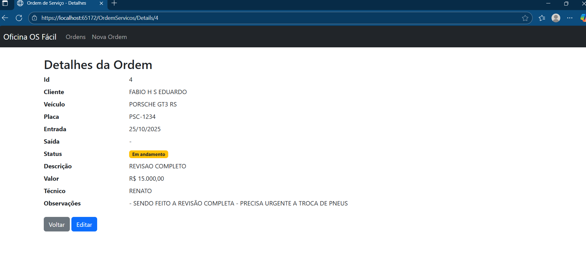

# Ordem de Serviço Automotivo

Projeto: Ordem de Serviço Automotivo (ASP.NET Core MVC)

Repositório: https://github.com/fabioeduu/OS_servico_automotivo


## Nomes e RMs dos integrantes do grupo

- Fabio H S Eduardo - RM560416
- Gabriel WU Castro - RM560210
- Renato Kenji Sugaki - RM559810


## Resumo / Objetivo do projeto

Aplicação ASP.NET Core MVC (sem banco de dados) para gerenciar ordens de serviço automotivas.
Permite operações CRUD (Create, Read, Update, Delete) e pesquisa por cliente/veículo/placa.
Armazenamento em memória (repositório in-memory) para fins demonstrativos / entrega.


## Características do projeto

- Plataforma: .NET 6 (TargetFramework: `net6.0`)
- Arquitetura: ASP.NET Core MVC com controllers, views Razor e TagHelpers
- Padrão de persistência: Repository pattern com interface `IOrdemServicoRepository` e implementação in-memory `InMemoryOrdemServicoRepository` registrada como singleton via DI
- Injeção de dependência (DI): registro em `Program.cs`:

```csharp
builder.Services.AddSingleton<IOrdemServicoRepository, InMemoryOrdemServicoRepository>();
```

- Views: Razor Views para `Index`, `Details`, `Create`, `Edit` e `Delete`
- TagHelper personalizado: `StatusBadgeTagHelper` para exibir badges de status das ordens
- Frontend: Bootstrap via CDN usado nas views para estilo/layout

## Rodar aplicação:

Como abrir e rodar (Visual Studio 2022):
1. Abra o Visual Studio 2022.
2. Abra a pasta `C:\Users\grana\Desktop\OrdemServicoApp` (File -> Open -> Folder).
3. Se preferir, execute `dotnet build` e `dotnet run` na pasta do projeto via PowerShell.

## Estrutura de arquivos:
- /OrdemServicoApp/OrdemServicoApp.csproj - projeto
- /OrdemServicoApp/Program.cs - configuração mínima e DI
- /OrdemServicoApp/Controllers/OrdemServicosController.cs
- /OrdemServicoApp/Models/OrdemServico.cs
- /OrdemServicoApp/Images/Imagens do projeto
- /OrdemServicoApp/Data/ - repositório e interface
- /OrdemServicoApp/TagHelpers/ - StatusBadgeTagHelper
- /OrdemServicoApp/Views/ - Views Razor e Shared Layout
- /OrdemServicoApp/wwwroot/ - assets estáticos

## Endpoints / Rotas (MVC padrão)

A aplicação usa a rota MVC padrão configurada em `Program.cs`:

```
pattern: "{controller=OrdemServicos}/{action=Index}/{id?}"
```

Rotas principais (controller `OrdemServicosController`):

- `GET /OrdemServicos` — Index (opcional query string `q` para pesquisa): ex: `/OrdemServicos?q=fabio`
- `GET /OrdemServicos/Details/{id}` — Visualiza os detalhes de uma ordem
- `GET /OrdemServicos/Create` — Retorna o formulário para criar nova ordem
- `POST /OrdemServicos/Create` — Recebe o modelo e cria a ordem
- `GET /OrdemServicos/Edit/{id}` — Retorna o formulário de edição
- `POST /OrdemServicos/Edit/{id}` — Recebe o modelo e atualiza a ordem
- `GET /OrdemServicos/Delete/{id}` — Confirma a exclusão
- `POST /OrdemServicos/Delete` — Executa a exclusão e redireciona para Index

> Observação: Não existe uma API REST separada — toda interação é via MVC com Views (HTML forms).

## Demonstração do Sistema

---
### Terminal


### Inicio


---

### Criando ordem


---

### Ordem criada


---

### Detalhes sobre a ordem de serviço


---

## Modelos principais

- `Models/OrdemServico.cs`
  - Propriedades: `Id` (int), `Cliente` (string), `Veiculo` (string), `Placa` (string), `DataEntrada` (DateTime), `DataSaida` (DateTime?), `Status` (enum `StatusOrdem`), `Descricao` (string), `Valor` (decimal), `Tecnico` (string), `Observacoes` (string)

- `Models/StatusOrdem.cs`
  - Enum com valores: `Aberta`, `EmAndamento`, `Concluida` (conforme uso nas views)


## Como rodar (desenvolvimento)

Requisitos mínimos:

- .NET 6 SDK
- (Opcional) Visual Studio 2022 ou VS Code + extensão C#

Comandos (PowerShell) — executar na raiz do projeto `C:\Users\grana\Desktop\OrdemServicoAutomotivo`:

```powershell
# Build
dotnet build .\OrdemServicoApp.csproj

# Run
dotnet run --project .\OrdemServicoApp.csproj
```

A aplicação será exposta em `https://localhost:<porta>` conforme o console informar (ex.: `https://localhost:65172`).


## Dependências / Pacotes NuGet

- O `OrdemServicoApp.csproj` não declara pacotes NuGet adicionais além do SDK (`Microsoft.NET.Sdk.Web`).
- Recursos MVC, Razor e componentes web são fornecidos pelo framework (`Microsoft.AspNetCore.App`).


## Testes

- Atualmente não há testes automatizados no repositório.
- Recomenda-se criar um projeto de testes, ex. `OrdemServicoApp.Tests`:


## Diagrama / Arquitetura

Adicione imagens em `docs/images/` e referencie-as abaixo. Exemplo de diagrama em ASCII incluído:

```
+----------------------+        +-------------------------------+
| OrdemServicosController | ---> | IOrdemServicoRepository (DI) |
+----------------------+        +-------------------------------+
                                       /
                                      /
                             +--------------------------+
                             | InMemoryOrdemServicoRepo |
                             +--------------------------+
```

Fluxo: Usuário (browser) -> Controller -> Repositório (in-memory) -> Lista de Ordens

## Configurações adicionais

- `Properties/launchSettings.json` contém perfis usados pelo Visual Studio para debug.
- `wwwroot/` contém assets estáticos (CSS/JS) — Bootstrap é carregado via CDN nas views.

## desenvolvido:

CheckPoint desenvolvido para a disciplina de Advanced Business Development with .NET
